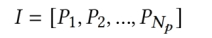
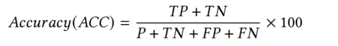
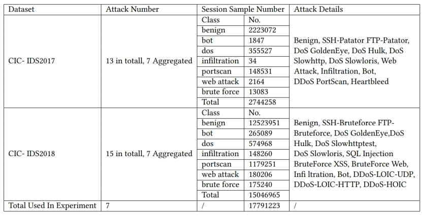

  Language:
  🇺🇸
  <a title="Chinese" href="/README_CN.md">🇨🇳</a>

# 1 Work Overview

## 1.1 Background

The rapid development of Internet of Things (IoT) technology has facilitated the development of various innovative services and applications, such as smart manufacturing, smart healthcare, and smart transportation. A large number of IoT communications communicate between various IoT entities, passing information such as swtich control, smart Facility Management, communication details, and equipment maintenance details, which often contain various issues arising from normal production or violations that may compromise the security of IoT communications.

The cybersecurity threats faced by the Internet of Things are more complex, with four specific security risks.

**🥰 Wireless data transmission links are vulnerable**

The data transmission of the Internet of Things generally uses wireless radio frequency signals to communicate. The inherent vulnerability of wireless networks makes the system vulnerable to various forms of attacks. In addition, wireless transmission networks can easily lead to difficult protection during signal transmission, and are easily hijacked, eavesdropped or even tampered with by attackers.

**🥰 Transmission networks vulnerable to Distributed Denial-of-service**

Due to the large number of nodes in the Internet of Things and the existence of clusters, attackers can use the controlled nodes to send malicious data packets to the network and launch Distributed Dial-of-service, causing network congestion, paralysis, and service interruption.

**🥰 Unauthorized access and network access**

User unauthorized access to the network, illegal use of network resources would attack the network. Additionally, user unauthorized access to the network, access to internal network data, such as user information, configuration information, routing information should also be taken into consideration.

**🥰 Communication network operator emergency management and control risks**

For communication network operators, the traditional management and control of communication functions such as SMS, data, and voice is mainly based on a single device, a single function, and a single user. However, the end point of IoT devices is large in scale, and there are many combinations of communication functions such as SMS and data in different services. If mass emergency management and control of communication functions cannot be implemented on the network side through multiple dimensions such as geography, business, and users, it will be impossible to cope with the risks caused by massive end point charges.

## 1.2 Introduction of works

The rapid development of Internet of Things (IoT) technology has generated a large amount of Traffic, which usually contains various problems arising from normal production or violations that may compromise the security of IoT communications, such as autonomous driving, industrial IoT, smart home, etc. Collecting these Traffic can detect intrusions through IoT networks. Despite great efforts in annotating IoT Traffic records, the number of flagged records is still very small, increasing the difficulty of identifying malicious attacks. We implement a Semi-Supervised Deep Learning Method (ESet) -based Intrusion Detection System for the Internet of Things.

 

**Ji XiaoAn is committed to implementing a high precision, fast, robust and lightweight anomaly-based intrusion detection system.**It can be deployed on the [Internet of Things Cloud Computing Platform](http://www.nlecloud.com/about), trains models on the cloud layer and performs Traffic detection at the detection layer, which is lightweight and practical.

**We preset the application model of the embedded intrusion detection framework**, which consists of a cloud layer, a detection layer and an edge layer. After collecting Traffic at the edge layer, the collected Traffic will be subjected to feature processing and Model Training in the cloud layer, and anomaly detection will be performed on the subsequent Traffic at the detection layer. With the support of powerful Deep learning prediction speed and accuracy, it can predict the intrusion detection behavior of the IoT system in real time and alert users.

**We design a semi-supervised model architecture for real-time application of semi-supervised prediction**, making full use of unlabeled network Traffic data to construct a real-time NID system, and using the self-designed trustworthiness selector module to provide quality assurance for pseudo-labels based on the sensitivity of kitnet Algorithm to malignant Traffic data. We propose a frequency domain coding converter, which realizes the analysis of extracted frequency domain features and byte coding features.

**In terms of operation effect, we have excellent performance in both experimental results and robustness.**First, under the premise that it becomes difficult to manually label a large number of IoT records, only a small part of the IoT Traffic can be labeled, and most of the rest can be unlabeled. Ji Xiaoan can efficiently learn from a small amount of labeled data and a large amount of unlabeled data. He achieved excellent performance against NIDs with a small part of labeled data (10%) on the IDS2017 and IDS2018 datasets (F1 score: 99.48%). In extreme cases, only 1% of the data is used, and the F1 value exceeds 97%. For the current attacks against ML /DL weaknesses, we conduct different types of tests by simulating the behavior of the opponent, PDR less than 5%, showing the high robustness of Ji Xiaoan.

# 2 Design and Implementation

## 2.1 Overall design and function introduction

We design the application model and functions of Ji Xiaoan in the real-world IoT network. The figure below shows the application model of Ji Xiaoan's medium and semi-supervised intrusion detection framework.

 

The structure of the Internet of Things network is mainly composed of three layers, namely the cloud layer, the detection layer and the edge layer.

The cloud layer holds high and powerful computing resources. Therefore, the Model Training process takes place at this layer, as the training requires obtaining a large amount of IoT tracking data. Such Big data can be easily aggregated and stored in the cloud. In addition, the cloud layer stores the model configuration, old pre-trained versions, and other settings related to the training transaction.

The detection layer usually consists of many fog servers/devices, bringing the computation closer to the edge of the IoT network. In IoT networks, the detection layer has a critical role as it is where intrusion detection occurs. Specifically, each detection node consists of four main parts: 

1) Network Traffic Aggregation; 
1) Network Traffic Preparation part
1) Network Traffic Countermeasures
1) Network Traffic Diagnosis. 

The Traffic Aggregation component is responsible for capturing and receiving the IoT Traffic records from the connected part of the edge IoT network, and then passing the batches of samples to the preparation phase. 

The edge layer consists of edge nodes and edge devices (i.e. laptops, smartphones, smartwatches, etc.) that communicate through the IoT network through routing and switching devices, and are simultaneously connected to specific fog servers/nodes as a computational bridge to the back end of the cloud.

## 2.2 Design scheme

### 2.2.1 System Environmental Design

Now all the communication between cloud IoT platforms and devices is essentially built on TCP/IP protocols, just re-encapsulation of data packets, based on which we can use Wifi, 4G to achieve communication between devices and Cloud Computing Platform.

Based on the preset application scenario model of Ji Xiaoan, we design a real IoT network system instance. At the same time, "Ji Xiaoan-IoT network inspection expert" is embedded in the detection layer nodes. The specific network topology structure is shown below. We use the Windows 10 x86 system host to simulate the detection layer nodes. In order to simplify the configuration of the instance, after completing the traffic collection at the edge layer, according to our predicted application scenario, the next step is to perform Model Training and detection layer prediction in the cloud layer. Here it is simplified to use the cloud-trained model to directly complete the prediction of the model at the detection layer. This architecture is the simplest architecture, the device is like our mobile phone, based on mobile communication to access the Internet.

 

Figure 4 Example system environment

#### 2.2.1.1 Hardware

Cloud environment:

Intel Sky Lake-E, 12 multi-core processor built on the experimental environment, using Ubuntu 18.04.6 LTS, 3.10.0-1062.9.1.el x86_64 operating system; we also use NVIDIA's GV104 [GeForce GTX 1180] as our GPU environment to accelerate our experiments.
Detection layer equipment:

1. Honor Magic Book 2019 laptop with Windows 10 x86 system
   Edge layer devices:
2. Honor20 smartphone

3. Xiaomi full screen TV EA65

4. Fluorite C6CN Starlight Surveillance Camera * 2

5. Xiaomi watch S1 smart watch

#### 2.2.1.2 topology description

**Host server**: Windows system computer, and set it as a WIFI hotspot, and then let our home devices are connected to this WIFI to form an Internet of Things, so that all device data Traffic through the server, and deploy Ji Xiaoan - Internet of Things network detection expert on the service.

The detection system will analyze the Traffic information of each device, and once it is found that there is a malicious attack that reaches a certain threshold, Traffic will issue an alert by e-mail, reminding relevant staff to pay attention to check the network environment and disconnect the network connection of related devices if necessary.

**Network intrusion topology example**: The following is a proposed network intrusion topology, a hacker from the outside access or breakthrough connected to the network, and then send malicious network data to the camera 1, and then detected by our software, and then send an early warning message to the relevant personnel, and then by the relevant personnel to detect.

 

Figure 5 Example of network intrusion alarm

### 2.2.2 Low-level Algorithm Design Scheme

#### 2.2.2.1 Method Overview

Internet of Things Network Intrusion Detection (IoTNID), as an important active security defense technology, aims to achieve accurate detection of network attack events. In recent years, many supervised and unsupervised methods have been proposed for IoTNID. However, these methods mainly face two challenges. First, the vast majority of network traffic data is unlabeled, and existing methods cannot effectively combine these unlabeled data with existing tagged network traffic data to improve the accuracy of detection. Secondly, they cannot learn features from different layers of network Traffic data, such as data packet hierarchy and Traffic hierarchy, so as to have a comprehensive understanding of network Traffic characteristics. To address these challenges, we propose an extreme semi-supervised model (ESeT) based on a dual-feature coding converter, which uses only a very small amount of labeled data, makes full use of unlabeled network Traffic data to enrich the extracted feature information and reduces the negative impact of false pseudo-labels through a confidence selector. Furthermore, we propose a Multi-level Feature Extraction to learn Traffic-level frequency-domain features and data packet-level byte-coding features. Experimental results show that our model achieves excellent performance on NIDs not only on IDS2017 and IDS2018 datasets with a small percentage of labeled data (10%) (F1 score: 99.48%).

 

Figure 6 Eset overall architecture

The figure above shows the underlying Deep learning foundation of our IoT network system - ESeT, which consists of two modules, namely multi-level feature extraction and semi-supervised bi-feature coding converter. Multi-level feature extraction includes byte encoding and frequency domain feature extraction, with the purpose of extracting byte features and frequency domain features of network working Traffic. The semi-supervised bi-feature coding converter includes the bi-feature coding converter as the core components of prediction, confidence selector and feature enhancer, and it describes the semi-supervised training process. The raw input data consisting of labeled and unlabeled pcap data packets is sent to the multi-level feature extraction module. After extraction, the processed data is provided to the semi-supervised training module for prediction.

#### 2.2.2.2 multi-level feature extraction

Traffic is first filtered and separated into sessions. Then, the filtered and separated network traffic is analyzed by random Vector byte encoding and frequency domain feature extraction, and byte features and frequency domain features are extracted.

1. Random Vector byte encoding

(1) anonymization.

Addresses in network traffic data, including MAC Source and destination addresses, as well as IP source and destination addresses may reveal the class labels of traffic data, we use anonymization to deal with this problem, replacing all MAC addresses with 00:00:00:00 and all IP addresses with 0.0.0.0.

(2) Numerical coding

After anonymizing the data packet, we read the data packet in binary format and convert it to a sequence of 8-bit integers in the range [0-255].

(3) Uniform length

We determine; as the data packet length. For the data of each data packet, we truncate it or fill the data below this length with 0 to guarantee a uniform length.

(4) Random Vector encoding

We use the method of randomly initializing vectors to render the raw bytes with randomly initialized floating-point vectors, which greatly reduces the space footprint compared with one-hot encoding. In addition, since every numeric unit has a value and the numbers have practical significance, it provides a basis for the subsequent positional encoding and bi-feature encoding of our semi-supervised converter.

 

Figure 7 Random Vector byte encoding steps

2. Frequency domain feature extraction and analysis

First we denote each data packet feature of all data packets as a matrix S, where Sik is defined as the i k-th attribute of the i-th data packet,

 

Then multiply S by a coding vector w for linear transformation, and the value of w is realized by the automatic parameter selection module, resulting in

 

Next we need a frame-based discrete Fourier transform, first split the data packet into frames, we denote the number of frames as Nf, and the length of the frame as Wseg, denoted as:

 

After we perform a discrete Fourier transform (DFT) on each frame, we can get the frequency characteristics of each frame as follows:

 

Fik is the i frame with a frequency of 2π (k − 1)/Wseg. Since the Fourier transform is a complex number, it cannot be used as the Machine Learning input to the Machine Learning Algorithm. Using the coordinate plane method, we convert complex numbers to real numbers and compute the modulus of the frequency domain representation. In order to make the frequency domain features numerically stable and prevent floating point overflow in Machine Learning training, we perform a logarithmic transformation to obtain the result as shown below:

 

 

#### 2.2.2.3 Multiple Feature Fusion Coding Transformer Construction

The two-feature coding converter (DET) is a core component of our semi-supervised learning model. DET itself can serve as a top-level supervised traffic classification model , achieving high performance in semi-supervised training with only a few labeled samples.

 

The overall structure of DET is shown in the above figure. DET receives the byte encoding result given by the feature extraction module to obtain a metric I , including $N_p$ sub-metric $P_i$, in the shape of $N_b \times N_e$. Each matrix represents a feature of a data packet, where $N_b$ represents the number of bytes used for byte encoding, $N_e$ represents the length of the random byte-encoded Vector. Fuse the frequency domain feature results into the Transformer model.

 

After position encoding, the data is processed in a two-feature encoding along with the extracted frequency-domain features. The two-feature encoding first obtains the output of the frequency-domain feature extraction and extracts a matrix F related to the frequency-domain features of these $N_p$ data packets of size $N_f \times N_p$ . The coding vector V (length $N_f$) is designed to determine the learning weights for each frequency-domain feature, which will be automatically generated and updated through successive Model Training. The process of obtaining the frequency domain characteristic values of the $N_p$ data packet is shown in the following formula.

 

Wherein, $V_{indexMask}$  represents the input for selecting the DFT. $N_f$ data packet corresponding to the frequency domain feature 0-1 index metric, $f_{i,k}$ represents the first i data packet frequency domain feature on the k-th attribute, V represents the coding vector, $W_{FD}$ represents the final frequency domain feature value of each data packet.

Since the frequency domain feature and the byte feature characterization are in different dimensions, it reflects the frequency domain feature of the data packet based on the flow granularity on specific attributes. It cannot simply be used as a byte attribute and the original byte encoding feature for lateral splicing. We implement the weighted-residual join operation on the basis of the original encoding, and the obtained result is used as the output of the frequency domain feature encoding. This not only incorporates the frequency domain feature based on the stream, but also retains the unaltered byte feature of the original data source packet.

The encoder consists of N identical layers, in which there are two sublayers, representing the multi-head self-attention mechanism and the fully connected feedforward network layer, respectively. Residual connections are implemented around the two sublayers, and layer normalization is performed.

After N identical encoders, the classification layer is added to the output for prediction. The classification layer is implemented by a linear sublayer and a sortmax sublayer, which embeds classes into the number of classes as an indicator of the final classification result.

#### 2.2.2.4 semi-supervised training architecture

1. Model Training View

We split the raw training data into labeled and unlabeled data to simulate a semi-supervised situation. We sample the data using proportional screening to ensure that each class of unlabeled samples has the same scale as the class in the entire training data.

(1) Model pre-training

First, both labeled and unlabeled data are input to the multi-level feature extraction module.

After FE After that, all data samples (including all labeled and unlabeled data) are used for kitnet training of the confidence selection module, and the first 50 % labeled data samples are selected to pre-train the DET to ensure that it has basic Traffic anomaly detection capabilities.

(2) Each round of training

In each round, a certain proportion of samples are selected as the input to the DET and kitnet networks. DET predict the classification result, while kitnet generates an RMSE vector representing the root mean square error of the difference between malignant data and benign data. Based on the judgment of RMSE values and prediction results, the trustworthiness selector filters out data that can be used as raw materials for pseudo-labels. The qualified prediction data screened out by the trustworthiness selector module will be mixed with a certain proportion of labeled samples, and the feature enhancement module fuses the output of the trustworthiness selector with some labeled sample data, and performs feature enhancement. After processing, these data will be used as pseudo-labeled data samples, and then input to the converter model for training. At this point, the model enters a new half-training round.

2. Confidence Level Selector

The confidence selector is designed to filter out predictions with high confidence and discard those with low confidence.

Confidence Level Guarantee Mechanism Based on Kitnet

The implementation of Kitnet Algorithm is to filter the prediction results from the DET using the RMSE values positively correlated with the malignancy rate. Kitnet is a lightweight core algorithm of Kitsune [23], which is used to generate a differentiated indicator RMSE that distinguishes malignant Traffic from benign Traffic. Although not accurate enough for prediction, in our experiments, the RMSE value proved to be a good evaluation indicator of the reliability of prediction results. Since only a small number of samples are trained, DET itself is not enough to make accurate classification results, the credibility selector helps to filter out the prediction results with high confidence and discard those with low confidence. The pseudo-label samples of the new round of transformer learning are more accurate.

(2) The principle of screening and filtering

After generating RMSE using the pre-trained kitnet mapper, the trustworthiness selector filters out benign labeled data whose RMSE value is lower than the malignant RMSE limit, and malignant data whose RMSE value is lower than the benign RMSE limit. Both benign and malignant RMSE limits are automatic parameters that are learned by each round of training and duration. The whole process can be expressed as:

 

Wherein, I represents the input feature of each round of data packet, RMSEs represents a vector of RMSE values, $T_m$ , $T_b$ represents a benign RMSE threshold and malignant RMSE threshold, the mask indicates the result of selecting high Confidence Level data index.

3. Feature enhancement module

In order to ensure that the model will not deviate from the original prediction accuracy due to inaccurate pseudo-labels during continuous training, we add a certain proportion of label samples to each round of pseudo-label generation. Since the same type of attack Traffic has similar frequency domain features, in order to further enhance the features for better training effect, we randomly select the frequency domain features of the labeled Traffic data, and randomly exchange them with the byte-encoded features of the predicted Traffic data of the same class in the original labeled samples to generate new data samples.

### 2.2.3 System function design

The main function of this system is to collect the data packet of each device flowing through the server network interface card, and then transmit it to the trained intrusion detection model to obtain the prediction result, and store it in the corresponding database, and then organize and transmit the data to the front end page. The front end maintains a table for each device for rolling display, and issues a warning when the proportion of data packets that detect instantaneous malicious attacks reaches a certain threshold. This makes it possible to monitor the entire network environment in the Internet of Things in real time and protect the cyber security of each device. And after experimental tests, the system can also do real-time detection and analysis under the high-load network environment of 20,000 data packets per second.

 

#### 2.2.3.1 design

When the program runs, you first need to select the local network interface card to be captured, that is, the network interface card used as the hotspot.

 

After the selection is complete, the program will scan all devices connected to this network interface card, and then the user will select the device to monitor, here is select all:

 

After confirming, you will enter the monitoring screen:

 

Click Start Start and the program starts running.

 

If the malicious packet rate of a certain device reaches a certain threshold, a pop-up warning will be sent, and emails and text messages will be sent to the pre-set user:

 

 

#### 2.2.3.2 monitoring interface design

 

 

#### 2.2.3.3 system interface design technical description

This program is developed using Python, the Python version used is 3.8.6, the development tool is Pycharm, and the running platform is Windows10.

**Pyqt5 Front-end UI The framework implements the system to realize the page design**. Adhering to the Interface Segregation Principle in the design process, an interface only does one thing, and a button only corresponds to one function, ensuring the program function decoupling, high Aggregation and low coupling. At the same time, it fully increases the code to reuse, showing that the data table of different devices uses the same class for design and reuse.

**SMTP The service realizes 163 mailbox email sending**. We have registered a special account to send emails to system users to inform users of threatening content in a timely manner.

Sqlite realizes front-end separation and data interaction. The program front-end display is separated from back-end network card data packet capture, prediction and other functions, and data transmission interacts through the Sqlite database.

**Multi-threading technology ensures front-end and back-end concurrent execution**. Due to the simultaneous analysis and processing of traffic data of different IP corresponding IoT devices, as well as taking into account the system front-end display and mail sending, each part of the function needs to be coordinated through multi-threading technology to ensure the stable operation of the program.

#### 2.2.3.4 SQL Database Description

This program uses Sqlite data. Sqlite is an in-process library that implements a self-sufficient, serverless, zero-configuration, transactional SQL database engine. It is a zero-configuration database that does not require installation or management, does not require a separate server process or operating system, and has a very small capacity, less than 400KB when fully configured. At the same time, it has strong compatibility to ensure stable operation on different computers.

After selecting the device to be monitored, each device program to be monitored will go to Sqlite to create a corresponding data database & table, and the subsequent captured data packets will be stored in the corresponding data database & table item after parsing in the program. The structure of the data database & table is as follows:

| Field name | Field description | Data type | Length | Null allowed | Remarks |
| --------------- | ---------------- | -------- | ---- | ---------- | --------- |
| Index | data packet number | int | | N | primary key, index |
| Time | data packet capture time | int | 50 | N | |
| SourceAddr | data packet source address | varchar | 18 | N | |
| DestAddr | data packet destination address | varchar | 18 | N | |
| Length | data packet length | int | | N | |
| Type | data packet type | varchar | 50 | N | |
| IsBad | Whether malicious | int | | N | |
| AllData | data packet byte information | text | | N | |

 

## 2.3 Evaluation Indicators

Ji Xiaoan is committed to achieving a high precision, fast, robust and lightweight AIDS. Therefore, we set up the following evaluation indicators to evaluate the performance of Ji Xiaoan, and give the real performance of Ji Xiaoan in detail in the subsequent test part.

(1) Accuracy: measure the proportion of predicted samples to total samples, and the proportion of malignant traffic to total samples:

 

(2) Accuracy: measures the proportion of true positive samples among all predicted positive samples. The proportion of all predicted positive samples:

 

(3) Match rate: measures the proportion of all positive samples, the proportion of all positive samples that are actually predicted to be positive:

 

(4) F1 score. As a measure of the weighted average of PRC and RCL, it is a composite response to performance results. The weighted average of RCL, which is a composite response to performance results, the closer the value is to 1, the better the performance results. The closer the value is to 1, the better the performance results:

 

(5) Training time per unit data packet. Characterize the training duration for data samples. In order to achieve real-time training and save computing resources, this value should be as small as possible:

 

(6) Unit data packet prediction time. Characterize the duration of prediction for data samples. In order to minimize the time loss in the real-time prediction process, this value should be as small as possible:

 

## 2.4 Dataset

IDS2017 and IDS2018 showcase the recent IDS dataset by Sharafaldin et al. [19] of the Canadian Cyber Security Institute, called CIC-IDS, which contains the most traditional attack categories, as well as unaltered real-world benign traffic widely used in intrusion detection experiments.

The Mawilab dataset is derived from the WIDE MAWI gigabit backbone (during January 1-10, 2022) documented in the MAWI archive [20]. As it has been continuously updated with mature labeling methods, it incorporates a wider range of recent attack types and has fine-grained classification results. For our experiments, we select the data from January 1-10, 2022 as the model's comparative experimental validation of different attack results.The Mawilab dataset is derived from the WIDE MAWI gigabit backbone (during January 1-10, 2022) documented in the MAWI archive [20]. As it has been continuously updated with mature labeling methods, it incorporates a wider range of the latest attack types and has fine-grained classification results.

 

The data we use is the original PCAP data packet Traffic, and the specific data sample in wireshark is shown.

 

 

# 3 Work Testing and Analysis

## 3.1 Intrusion Detection Algorithm Experimental Test

To validate the feasibility of the model, we conduct experiments using the latest IDS datasets IDS2017 and IDS2018. IDS2017 and IDS2018 showcase the latest NoTNID dataset from Sharafaldin et al. [27] of the Canadian cyber security Institute, which contains attack categories for a wide range of IoT networks, as well as unaltered real-world benign traffic widely used in IoT network intrusion detection experiments.

Detailed dataset information is shown in the table below:

 

Table 2 Dataset Details

### 3.1.1 Experimental Environment

We built our experimental environment on an Intel Sky Lake-E, 12 multi-core processor using Ubuntu 18.04.6 LTS, 3.10.0-1062.9.1.el 7.x86/64 operating system; we also used NVIDIA GV104 [GeForce GTX 1180] as our GPU environment to accelerate our experiments.

### 3.1.2 Comparing experiments and results

This experiment compares the performance of our model with the latest supervised, semi-supervised and unsupervised models on the IDS2017 and IDS2018 datasets.

 

Figure 1 Comparison of experimental results

In order to ensure fairness of experimental results, all supervised learning models are trained with only labeled data, while semi-supervised and unsupervised models are trained with all labeled and unlabeled data. The left figure compares and analyzes the best existing model with 10% of labeled training data. The right figure shows the performance results of ESeT in different proportions of labeled training samples. 1%, 5%, 10%, and 20%.

In all the semi-supervised and supervised vs. unsupervised learning model Algorithms, the proposed model achieves good performance results on all metrics. In the extreme case, the F1 value exceeds 97% using only 1% of the data. This is sufficient to demonstrate that the proposed model achieves excellent performance results under different proportions of the training data.In this case, the proposed algorithm achieves excellent performance results on all metrics.

## 3.2 Ablation experiment

In order to further verify the performance of the model under more diverse and rich attack types, we selected all Traffic data from January 1 to 10, 2022 in the mawilab dataset for comparison experiments. The dataset includes a total of 43 attack types. The attack traffic distribution and prediction results are shown in the figure below:

 

Figure 2 Summary of attack types on the mwilab dataset

Consistent with the previous description, we also trained the model on a 10% scale of labeled samples and compared performance results for different attack types across 43 mawilab datasets.

Our performance on the entire mawilab dataset also achieves a high performance, with an F1 value of 99.7%. From the table, we can find that the QIIS can achieve a prediction accuracy of 99% or higher for most attacks.

## 3.3 Robustness Experiment

In addition to focusing on the performance metrics of the model (F1, accuracy, Match rate, etc.), we also evaluate the robustness of the model against adversarial attacks. Below, we evaluate the robustness of the model under the mawilab dataset by simulating two attack modes: layer-based attacks (white box) and attacks of practical nature (gray box, Black box).

(1) Layer-based attacks

Our feature extraction is divided into byte encoding and frequency domain encoding. Due to the discreteness nature of features and the nature of non-numerical meaning, byte encoding is resistant to layer-based attacks. For frequency domain encoding, its robustness is evaluated in this experiment using an approach similar to FGSM [22].

We did a set of tests on mawilab, this perturbation had little effect on the model results, as shown in the following table:

 

(2) Attacks of a practical nature

We focus on two methods in [21]: utility gray box attack (PGA) and Black box attack (PBA). [21] The GAN-PSO-based algorithm generates evasion features that automatically change the original malicious traffic under limited overhead without affecting its functionality. The algorithm combines GAN and PSO methods to complete evasion attacks, which can be divided into the following two steps:

Adversarial Feature Generation: We assume that the attacker wants to start some activity, which will trigger a series of malicious traffic. First, the attacker needs to collect some benign traffic in the network he controls. Then, the two types of traffic are extracted into features through a proxy extractor and fed into our GAN model. After the training phase, the generator is able to generate adversarial features.

2. Malicious Traffic Mutation: After generating the adversarial characteristics, we automatically mutate the malicious Traffic using a PSO with predefined operators. Each particle in the swarm represents a vector consisting of meta-information of the mutant Traffic. The swarm iteratively searches the traffic space, guided by a temporary best particle whose characteristics most resemble those of the adversarial one. Finally, after many iterations, the best particle is selected.

In addition to the traditional metrics (F1, Accuracy, Match Rate, Precision), [21] introduced new metrics (MMR and PDR) to measure the effectiveness of the attack. The relationship between attack effectiveness and robustness is that the better the attack, the worse the robustness.

The interpretability index (MMR) can clearly show the feature changes in the latency space during the attack, reflecting the proximity of malicious features and adversarial features in the mutation process.

Malicious probability drop rate (PDR) is used to measure the decline rate of malicious probability output by the target classifier. The higher the value of the PDR, the better the attack effect and the worse the robustness of the model.

PGA and PBA discard unrealistic assumptions in favor of more practical attacks. In short, in PBA, the attacker has very limited or no knowledge of the features used in the target NIDS, PGA the only difference between PBA and PBA is that the attacker knows our feature extractor.

PBA: An attacker without any knowledge of the target system can only simulate the extractor by using other features. Suppose he uses the model Kitsune [23] (a relatively mature IDS) as the target NIDS and obtains adversarial Traffic and inputs it into our model. The results in Table 4 show that although these modified Traffic achieve a good attack against Kisune (PDR = 23.00%), it is not sensitive to our model (ESet) (PDR = 2.10%).

 

PGA: We used frequency domain coding as a feature extractor to analyze the impact of different attack costs (l_c, l_t) on the robustness of the model. The first overhead, expressed in l_c, is the ratio of the number of crafted data packets to the original data source packets. The second overhead, expressed in l_t, is the time-consuming rate of mutated traffic vs. original traffic. We used lower l_c = 0.2, l_t = 2 and higher budget l_c = 0.5, l_t = 5) and the results are shown in Table 5. The results show that whether it is high cost (PDR = 5.25%) or low cost (PDR = 3.44%), the impact of PGA on ESet attacks is limited.

 

Taken together, these results demonstrate the robustness of ESet. In particular, our model is insensitive to adversary attack costs.

## 3.4 Stress Testing Experiment

The stress testing of this experiment is mainly to check whether our system can run smoothly in a multi-device and high concurrent network environment. The main source of pressure lies in whether the system can capture the data packet in all network interface cards in time, whether the model prediction can be completed in time, whether the data can be written to the database in time, and whether the page update displayed by the front end can keep up with the data packet generation speed in the network environment. The final evaluation indicator is the time it takes to send the data to the front end page display.

**Test scene**

This Stress Testing uses 3 computers to connect to the same server, turn off other software that may generate data packets on these 3 computers, use xcap software to perform code packet of the released version and control the rate size of the code packet of the released version. Then record the timestamp when the code packet of the released version is completed and the timestamp when it is displayed on the server side, and count the time it takes to display the code packet of the released version from the computer to the server side.

 

Figure 12 Stress Testing Scenario

**Test Results**

| Code packet of the released version speed (100Kb/s) | Response time (ms) |
| --------------- | ------------ |
| 1               | 50           |
| 10              | 50           |
| 100             | 63           |
| 300             | 183          |
| 500             | 472          |
| 800             | 841          |
| 1000            | 1598         |
| 3000            | 3721         |
| 5000            | 8154         |

 

**Analysis of test results**

The test results found that at a rate of less than 50000Kb/s, the response of the system is very fast, not more than 500ms, but with the increase of the rate of the code packet of the released version, the system will behave unstable, the average response time is greatly extended, and after the rate of more than 300000Kb /s, the system will become extremely stuck and difficult to operate normally. After fixed-point troubleshooting found that the main reason is that the front end for the update of the table, because each update to insert a row to the top of the table, and then fill in the data, and frequently update the table to insert data for the front end of the display is a big pressure point, while reading and writing the database is also a more time-consuming part.

For general non-industrial equipment such as home appliances, driverless vehicles, the total amount of data generated per second is generally 10000Kb/s, the maximum peak is 50000Kb/s, and this is within the tolerance of our system, which also shows that the performance of our system is sufficient for non-industrial IoT security monitoring.

# 4 Summary

## 4.1 Summary of works

Because of its openness, multi-source heterogeneity, ubiquity and other characteristics, the security of the Internet of Things is related to the security of individuals, families, society, and even the country. Ji Xiaoan is committed to realizing a high precision, fast, robust and lightweight anomaly-based intrusion detection system. It can be deployed on the [Internet of Things Cloud Computing Platform] (http://www.nlecloud.com/about), trains models on the cloud layer and performs Traffic detection in the detection layer, which is lightweight and practical.

We preset the application model of the semi-supervised intrusion detection framework, which consists of a cloud layer, a detection layer and an edge layer. After collecting Traffic at the edge layer, the collected Traffic will be subjected to feature processing and Model Training in the cloud layer, and anomaly detection will be performed on the subsequent Traffic at the detection layer. With the support of powerful Deep learning prediction speed and accuracy, it can predict the intrusion detection behavior of the IoT system in real time and alert users.

In the implementation method, we design a semi-supervised model architecture for real-time application of semi-supervised prediction, make full use of unlabeled network Traffic data to construct a real-time NID system, and use the self-designed credibility selector module to provide quality assurance for pseudo-labels based on the sensitivity of kitnet Algorithm to malignant Traffic data. We propose a frequency domain coding converter, which realizes the analysis of extracted frequency domain features and byte coding features.

In terms of operation effect, under the premise that it becomes difficult to manually label a large number of IoT records, only a small part of IoT Traffic can be labeled, and most of the rest can be unlabeled. Ji Xiaoan can learn efficiently from a small amount of labeled data and a large amount of unlabeled data. He achieved excellent performance on NID with a small part of labeled data (10%) on IDS2017 and IDS2018 datasets (F1 score: 99.48%). In extreme cases, using only 1% of the data, the F1 value exceeds 97%. At the same time, for current attacks against ML /DL weaknesses, we perform different types of tests by simulating the behavior of the adversary, PDR less than 5%, showing high robustness.

## 4.2 Business Value

With the advent of the "Internet +" era, the Internet of Things is developing rapidly and is gradually penetrating into all fields of life. The scale of IoT devices is showing an explosive growth trend. The era of the Internet of Everything is coming, and the importance of IoT security is becoming more and more prominent in the rapid development of the Internet of Things. According to the business form, the Internet of Things can be divided into three parts: industrial control Internet of Things, vehicle Internet of Things, and smart home Internet of Things, and different business forms have different business requirements for security.

However, with the rapid development of IoT technology, privacy and security are issues worth thinking about. According to the 10 most popular IoT smart devices surveyed by HP Security Research, almost all devices have high-risk Vulnerability. Some key data are as follows:

L 80% of IoT devices are at risk of privacy leakage or abuse;

L 80% of IoT devices allow weak passwords;

L 70% of IoT devices' communications with the Internet or LAN are not encrypted;

60% of IoT devices have security vulnerabilities in their web interfaces.

60% of IoT devices download software updates without encryption.

While the Internet of Things brings us convenience, the devices, networks, and applications of the Internet of Things are also facing severe security threats, such as:

In 2015, two cyber security experts used a man-in-the-middle attack to remotely control a Jeep on a highway (for example, controlling air conditioning, radios, windshield wipers, brakes, etc.). The attack demonstrated the dangers of a man-in-the-middle attack and led to the manufacturer to match 1.4 million vehicles. " The cameras in the "Water Drop LIVE" and "Hikvision" incidents were hacked and peeped at; the US created a zero-day Vulnerability virus and used "Stuxnet" to break into Iranian nuclear power plants and sabotage Iran's nuclear implementation plan; in 2015, the United Kingdom's network provider Talk Talk suffered several cyber security Vulnerability attacks, which exposed unencrypted stored customer data to the cloud. Hackers were able to easily access and steal millions of customers' credit card and bank details.

In terms of the share of IDS/IPS (Intrusion Detection/Prevention) market, Hardware accounts for the major part of IDS/IPS, accounting for about 45%, followed by hosted IDS/ISP, with a market share of about 31%, and web-based software accounting for 24%. With the development of the market, the growth rate of web-based IDS/IPS software is getting faster and faster. According to the product structure proportion distribution of Gartner cyber security industry, in 2019, the market size of intrusion detection/prevention equipment in China is about 1.9 billion yuan. The Internet of Things because of its openness, multi-source heterogeneity, ubiquity and other characteristics, the security of the Internet of Things is related to the security of individuals, families, society, and even the country, the emergence of various security threats, but also continue to confirm the Internet of Things network intrusion detection system The necessity.

## 4.3 Outlook of works

Ji Xiaoan-IoT Qualitative Intrusion Detection System is an accurate and rapid IoT intrusion detection system with powerful semi-supervised training model support, which can accurately and quickly predict the intrusion behavior of IoT network intrusion behavior; in continuous improvement, we will improve the functions of Ji Xiaoan-IoT Qualitative Intrusion Detection System from the following aspects:

In terms of security defense, the Ji Xiaoan-IoT qualitative intrusion detection system can accurately locate the IoT intrusion Traffic, intrusion point, intrusion time and traffic type at the same time for accurate prediction and tracking. However, in the overall defense strategy, a relatively single "disconnected connection" method is adopted to deal with the IoT connection of the attacked device, without considering the actual activities being carried out by different devices. In terms of response strategy, intrusion detection systems are divided into two modes - active response and passive response. The former only sends an alert notification for the collected abnormal conditions, without trying to reduce the damage caused or fight back against the attacker; the latter may control the attacked system and block or mitigate the impact of the attack. We will integrate different corresponding strategies. We will comprehensively consider the operating status of different devices, so as to block malicious traffic sources while saving the normal operating parameters of the devices, and minimize the wind direction without affecting the operating status of the devices.

In the architecture deployment, the data interaction between the "cloud layer" and the "detection layer" includes the transmission with the training model, the transmission of training data, and the transmission of detection data packets. Due to time and Hardware conditions, this part of the transmission is not well protected in the design of this model. If an attacker attacks the model during this transmission process, it will bring serious consequences. In the subsequent improvements, we will build an intranet protection mechanism and establish absolutely secure data transmission between the "cloud layer" and the "detection layer" to ensure the reliability of the entire Internet of Things detection system.

In the Application Area, the IoT security detection system designed by Ji Xiaoan cyber security experts is suitable for large enterprise-level network architectures and small home intelligent architectures. But not every home network can support servers with high computing power of cloud devices. Therefore, in the subsequent design, we negotiate a larger level system that can separate the Cloud as a Service and interweave many IoT security networks. This makes the training data more independent of the detection module and can be performed on the server cluster, so that you can not change the overall model performance without reducing the hardware consumption.

# 5 References

M. Stoyanova, Y. Nikoloudakis, S. Panagiotakis, E. Pallis, and E. K. Markakis, "A survey on the Internet of Things (IoT) forensics: Challenges, approaches, and open issues," IEEE Commun. Surveys Tuts., vol. 22, no. 2, pp. 1191–1221, 2nd Quart., 2020, doi: 10.1109/COMST.2019.2962586.

M. M. Hassan, S. Huda, S. Sharmeen, J. Abawajy, and G. Fortino, "An adaptive trust boundary protection for IIoT networks using deep-learning feature-extraction-based semisupervised model,” IEEE Trans. Ind. Informat., vol. 17, no. 4, pp. 2860–2870, Apr. 2021, doi: 10.1109/TII.2020.3015026. 

M. Saharkhizan, A. Azmoodeh, A. Dehghantanha, K.-K. R. Choo, and R. M. Parizi, "An ensemble of deep recurrent neural networks for detecting IoT cyber attacks using network traffic," IEEE Internet Things J., vol. 7, no. 9, pp. 8852–8859, Sep. 2020, doi: 10.1109/JIOT.2020.2996425.

M. A. Al-Garadi, A. Mohamed, A. K. Al-Ali, X. Du, I. Ali, and M. Guizani, “A survey of machine and deep learning methods for Internet of Things (IoT) security,” IEEE Commun. Surveys Tuts., vol. 22, no. 3, pp. 1646–1685, 3rd Quart., 2020, doi: 10.1109/COMST.2020.2988293

L. Li, J. Yan, H. Wang, and Y. Jin, “Anomaly detection of time series with smoothness-inducing sequential variational auto-encoder,” IEEE Trans. Neural Netw. Learn. Syst., early access, Apr. 13, 2020, doi: 10.1109/TNNLS.2020.2980749.

J. Wu, Z. Zhao, C. Sun, R. Yan, and X. Chen, “Fault-attention generative probabilistic adversarial autoencoder for machine anomaly detection,” IEEE Trans. Ind. Informat., vol. 16, no. 12, pp. 7479–7488, Dec. 2020, doi: 10.1109/TII.2020.2976752.

X. Wang, Y. Han, V. C. M. Leung, D. Niyato, X. Yan, and X. Chen, “Convergence of edge computing and deep learning: A comprehensive survey,” IEEE Commun. Surveys Tuts., vol. 22, no. 2, pp. 869–904, 2nd Quart., 2020, doi: 10.1109/COMST.2020.2970550.

M. Shafiq, Z. Tian, A. K. Bashir, X. Du, and M. Guizani, “CorrAUC: A malicious bot-IoT traffic detection method in IoT network using machine-learning techniques,” IEEE Internet Things J., vol. 8, no. 5, pp. 3242–3254, Mar. 2021, doi: 10.1109/JIOT.2020.3002255.

S. Gamage and J. Samarabandu, “Deep learning methods in network intrusion detection: A survey and an objective comparison,” J. Netw. Comput. Appl., vol. 169, Nov. 2020, Art. no. 102767.

Y. Cheng, Y. Xu, H. Zhong, and Y. Liu, “Leveraging semisupervised hierarchical stacking temporal convolutional network for anomaly detection in IoT communication,” IEEE Internet Things J., vol. 8, no. 1, pp. 144–155, Jan. 2021, doi: 10.1109/JIOT.2020.3000771.

L. Vu, V. L. Cao, Q. U. Nguyen, D. N. Nguyen, D. T. Hoang, and E. Dutkiewicz, “Learning latent representation for IoT anomaly detection,” IEEE Trans. Cybern., early access, Sep. 18, 2020, doi: 10.1109/TCYB.2020.3013416

J. Gao et al., “Omni SCADA intrusion detection using deep learning algorithms,” IEEE Internet Things J., vol. 8, no. 2, pp. 951–961, Jan. 2021, doi: 10.1109/JIOT.2020.3009180.

L. Xiao, X. Wan, X. Lu, Y. Zhang, and D. Wu, “IoT security techniques based on machine learning: How do IoT devices use AI to enhance security?” IEEE Signal Process. Mag., vol. 35, no. 5, pp. 41–49, Sep. 2018.

T. Ergen and S. S. Kozat, “Unsupervised anomaly detection with LSTM neural networks,” IEEE Trans. Neural Netw. Learn. Syst., vol. 31, no. 8, pp. 3127–3141, Aug. 2020, doi: 10.1109/TNNLS.2019.2935975.

J. Wang, C. Jiang, H. Zhang, Y. Ren, K.-C. Chen, and L. Hanzo, “Thirty years of machine learning: The road to Pareto-optimal wireless networks,” IEEE Commun. Surveys Tuts., vol. 22, no. 3, pp. 1472–1514, 3rd Quart., 2020, doi: 10.1109/COMST.2020.2965856.

F. Hussain, R. Hussain, S. A. Hassan, and E. Hossain, “Machine learning in IoT security: Current solutions and future challenges,” IEEE Commun. Surveys Tuts., vol. 22, no. 3, pp. 1686–1721, 3rd Quart., 2020, doi: 10.1109/COMST.2020.2986444.

N. Ravi and S. M. Shalinie, “Semisupervised-learning-based security to detect and mitigate intrusions in IoT network,” IEEE Internet Things J., vol. 7, no. 11, pp. 11041–11052, Nov. 2020, doi: 10.1109/JIOT.2020.2993410.

Ying Gao, Yu Liu, Yaqia Jin, Juequan Chen, and Hongrui Wu. 2018. A Novel Semi-Supervised Learning Approach for Network Intrusion Detection on Cloud-Based Robotic System. IEEE Access 6 (2018), 50927–50938. https://doi.org/10.1109/ACCESS.2018.2868171

G Karatas, O Demir, O K Sahingoz, Increasing the Performance of Machine Learning-Based IDSs on an Imbalanced and Up-to-Date Dataset[J], IEEE Access 8 (2020) 32150–32162.

WIDE. Accessed January 2021. MAWI Working Group Traffic Archive. http://mawi.wide.ad.jp/mawi/.

Dongqi Han, Zhiliang Wang, Ying Zhong, Wenqi Chen, Jiahai Yang, Shuqiang Lu, Xingang Shi, and Xia Yin. 2021. Evaluating and Improving Adversarial Robustness of Machine Learning-Based Network Intrusion Detectors. IEEE Journal on Selected Areas in Communications 39, 8 (2021), 2632–2647. https://doi.org/10.1109/JSAC.2021.3087242

Md Ashraful Alam Milton. 2018. Evaluation of Momentum Diverse Input Iterative Fast Gradient Sign Method (M-DI2-FGSM) Based Attack Method on MCS 2018 Adversarial Attacks on Black Box Face Recognition System. https://doi.org/10.
48550/ARXIV.1806.08970

Mirsky, Yisroel & Doitshman, Tomer & Elovici, Yuval & Shabtai, Asaf. (2018). Kitsune: An Ensemble of Autoencoders for Online Network Intrusion Detection. 